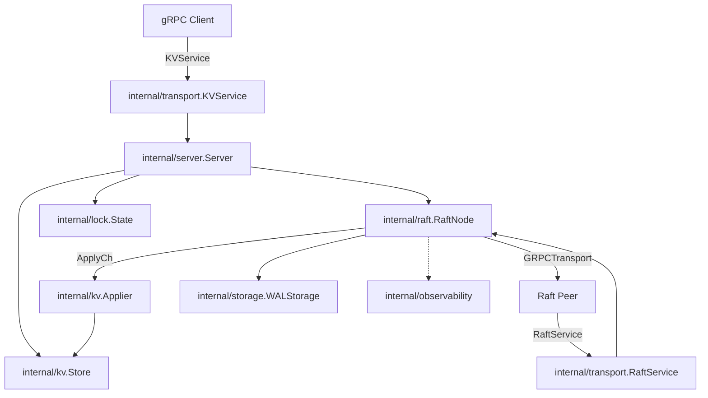

# RaftIQ

RaftIQ is a Raft consensus implementation written from scratch in Go, with
a replicated key-value store built on top of it. It also includes
tested-but-not-yet-wired-in libraries for distributed locking (fencing
tokens) and job scheduling, plus a gRPC transport, TLS/mTLS support, and
Prometheus observability.

The goal is to implement and validate distributed-systems guarantees from
first principles — election safety, log matching, leader completeness,
joint-consensus membership changes, linearizable reads, crash-safe WAL
persistence — rather than depending on an existing consensus library.

**This README states plainly what runs in the shipped binary versus what
exists as tested library code that isn't started by it.** For the full
evidence behind every claim here, see [`docs/AUDIT.md`](docs/AUDIT.md).

---

## Status

RaftIQ is an active, in-progress open-source project, not a finished
production system. Read this before deploying it anywhere that matters:

- **License is currently missing.** The `LICENSE` file in this repository
  is empty. Until that's fixed, treat the code as **all rights reserved** —
  do not assume MIT terms apply. See the [License](#license) section.
- **The shipped binary (`cmd/raftiq`) runs without TLS.** TLS/mTLS is
  implemented and tested (`internal/transport/tls.go`) but not wired into
  `main.go`. Raft and KV gRPC traffic is plaintext unless you build your
  own `main` package around the transport library. See
  [`docs/transport/security.md`](docs/transport/security.md).
- **The scheduler and worker are not started by the binary.** They're
  real, tested packages (`internal/scheduler`, `internal/worker`) meant to
  be embedded by a consumer; `cmd/raftiq` doesn't run them.
- **Distributed locking is implemented but not exposed over gRPC.** It's
  reachable from `internal/server.Server` in Go, not from the network
  client.
- **Membership changes (`AddMember`/`RemoveMember`) have no RPC or CLI.**
  They exist as `RaftNode` methods; driving them requires embedding the
  Go API.

## Key features

**Implemented and network-reachable in the `raftiq` binary:**
- Raft leader election with PreVote, term management, log replication, and
  commit-index advancement (`internal/raft`).
- Linearizable reads via `ReadIndex` (`RaftNode.ReadIndex`, used by the KV
  `Get` path).
- Log compaction / snapshots, including `InstallSnapshot` for lagging
  followers.
- A durable, CRC32-checksummed, crash-recoverable WAL
  (`internal/storage/wal.go`).
- A replicated KV store (`Get`/`Put`/`Delete`) over gRPC.
- Prometheus metrics on `-metrics-addr` (`/metrics`).

**Implemented and tested, but not reachable from the running binary today:**
- Joint-consensus membership changes (`AddMember`/`RemoveMember`) — Go API
  only, no RPC/CLI.
- Distributed locking with monotonically increasing fencing tokens
  (`internal/lock`, `Server.AcquireLock`/`FencedPut`) — Go API only.
- Distributed job scheduling and worker execution (`internal/scheduler`,
  `internal/worker`) — not started by `cmd/raftiq/main.go`.
- TLS/mTLS transport security — implemented, not wired into the CLI.
- Health/readiness HTTP endpoints (`internal/observability/health.go`) —
  implemented, not registered in `main.go`.

**Planned / scaffolding only:**
- Docker packaging (`deploy/docker/` exists but contains no Dockerfile).
- A configuration file / env-based config loader (currently CLI flags only).

See [`docs/AUDIT.md`](docs/AUDIT.md) for the full inventory with code and
test references.

## Architecture



`internal/raft` never imports `net`, gRPC, or a disk package directly — it
only talks outward through the `Transport` and `Storage` interfaces, which
is what makes it unit-testable with `LocalTransport` and `MemoryStorage`
instead of a real cluster. See [`docs/architecture.md`](docs/architecture.md)
for the full breakdown.

## Repository structure

```text
api/proto/          protobuf definitions and generated gRPC code
client/              Go gRPC client for the KV service
cmd/raftiq/          the CLI entry point / binary
internal/raft/        Raft consensus core (election, log, membership, snapshots)
internal/storage/     Storage interface, WAL, in-memory implementation
internal/model/       shared types (LogEntry, Configuration, Snapshot, Job, ...)
internal/kv/          deterministic KV state machine + applier
internal/lock/        fencing-token lock state
internal/scheduler/    job scheduling library (not started by cmd/raftiq)
internal/worker/       job worker library (not started by cmd/raftiq)
internal/transport/    gRPC transport, TLS/mTLS, KV/Raft services
internal/server/       glues raft + kv + lock together for cmd/raftiq
internal/observability/ Prometheus metrics, logging, health checks
tests/chaos/           multi-node failure-injection tests
deploy/                Grafana dashboards + empty Prometheus/Docker scaffolding
docs/                  detailed documentation (see map below)
```

## Requirements

- Go 1.26+ (see `go.mod`)
- `protoc` only if regenerating `api/proto/*.pb.go`

## Quick start

```bash
git clone https://github.com/sanchar127/raftiq.git
cd raftiq
go mod download
go build ./...
go test ./...
```

## Running RaftIQ

### Single node (for local experimentation)

```bash
go run ./cmd/raftiq \
  -id node1 \
  -raft-addr :7000 \
  -kv-addr :8000 \
  -metrics-addr :9090 \
  -data-dir ./data/node1
```

A single-node cluster still runs the full Raft protocol against itself and
will elect itself leader.

### Multi-node cluster

Every node needs the same `-peers` map (including itself) and a unique `-id`:

```bash
go run ./cmd/raftiq -id node1 -raft-addr :7001 -kv-addr :8001 -metrics-addr :9091 \
  -data-dir ./data/node1 \
  -peers node1=localhost:7001,node2=localhost:7002,node3=localhost:7003

go run ./cmd/raftiq -id node2 -raft-addr :7002 -kv-addr :8002 -metrics-addr :9092 \
  -data-dir ./data/node2 \
  -peers node1=localhost:7001,node2=localhost:7002,node3=localhost:7003

go run ./cmd/raftiq -id node3 -raft-addr :7003 -kv-addr :8003 -metrics-addr :9093 \
  -data-dir ./data/node3 \
  -peers node1=localhost:7001,node2=localhost:7002,node3=localhost:7003
```

The membership is fixed at startup via `BootstrapMembership()` — there is
no "join an existing cluster" flag. See
[`docs/operations.md`](docs/operations.md) and
[`docs/raft/membership.md`](docs/raft/membership.md).

## Testing

```bash
go test ./...
go test -race ./...
go vet ./...
go test -v -race ./tests/chaos/...
```

`make check` also runs `golangci-lint` and `govulncheck`. See
[`docs/testing.md`](docs/testing.md) for what each test package covers.

## Go client example

```go
package main

import (
	"context"
	"fmt"
	"log"
	"time"

	"github.com/sanchar127/raftiq/client"
)

func main() {
	ctx, cancel := context.WithTimeout(context.Background(), 5*time.Second)
	defer cancel()

	cli, err := client.Dial(ctx, "localhost:8001")
	if err != nil {
		log.Fatalf("failed to connect: %v", err)
	}
	defer cli.Close()

	if err := cli.Put(ctx, "example-key", []byte("example-value")); err != nil {
		log.Fatalf("put failed: %v", err)
	}

	value, err := cli.Get(ctx, "example-key")
	if err != nil {
		log.Fatalf("get failed: %v", err)
	}

	fmt.Printf("value: %s\n", value)
}
```

Note: if the node you dial is not the current leader, `Put` will fail with
a plain gRPC error rather than a leader redirect (see
[`docs/AUDIT.md`](docs/AUDIT.md)). Retry against another node in `-peers`.

## Documentation map

| Area | Document |
|---|---|
| Audit / implementation inventory | [`docs/AUDIT.md`](docs/AUDIT.md) |
| Architecture overview | [`docs/architecture.md`](docs/architecture.md) |
| HLD + LLD | [`docs/system-design.md`](docs/system-design.md) |
| Implementation walkthrough | [`docs/implementation.md`](docs/implementation.md) |
| Development workflow | [`docs/development.md`](docs/development.md) |
| Testing strategy | [`docs/testing.md`](docs/testing.md) |
| Configuration / CLI flags | [`docs/configuration.md`](docs/configuration.md) |
| Running / operating a cluster | [`docs/operations.md`](docs/operations.md) |
| Debugging common failures | [`docs/troubleshooting.md`](docs/troubleshooting.md) |
| Persistence overview | [`docs/persistence.md`](docs/persistence.md) |
| Raft: overview | [`docs/raft/overview.md`](docs/raft/overview.md) |
| Raft: leader election | [`docs/raft/leader-election.md`](docs/raft/leader-election.md) |
| Raft: log replication | [`docs/raft/log-replication.md`](docs/raft/log-replication.md) |
| Raft: commitment | [`docs/raft/commitment.md`](docs/raft/commitment.md) |
| Raft: membership | [`docs/raft/membership.md`](docs/raft/membership.md) |
| Raft: joint consensus | [`docs/raft/joint-consensus.md`](docs/raft/joint-consensus.md) |
| Raft: snapshots | [`docs/raft/snapshots.md`](docs/raft/snapshots.md) |
| Raft: linearizable reads | [`docs/raft/linearizable-reads.md`](docs/raft/linearizable-reads.md) |
| Raft: failure recovery | [`docs/raft/failure-recovery.md`](docs/raft/failure-recovery.md) |
| Storage: overview | [`docs/storage/overview.md`](docs/storage/overview.md) |
| Storage: WAL format | [`docs/storage/wal.md`](docs/storage/wal.md) |
| Storage: snapshots | [`docs/storage/snapshots.md`](docs/storage/snapshots.md) |
| Transport: overview | [`docs/transport/overview.md`](docs/transport/overview.md) |
| Transport: local (test) transport | [`docs/transport/local.md`](docs/transport/local.md) |
| Transport: gRPC | [`docs/transport/grpc.md`](docs/transport/grpc.md) |
| Transport: TLS/mTLS | [`docs/transport/security.md`](docs/transport/security.md) |
| Component: KV store | [`docs/components/kv.md`](docs/components/kv.md) |
| Component: distributed lock | [`docs/components/lock.md`](docs/components/lock.md) |
| Component: scheduler | [`docs/components/scheduler.md`](docs/components/scheduler.md) |
| Component: worker | [`docs/components/worker.md`](docs/components/worker.md) |
| Component: observability | [`docs/components/observability.md`](docs/components/observability.md) |

## Contributing

See [`CONTRIBUTING.md`](CONTRIBUTING.md), including the Raft safety
invariants contributors must not violate.

## Security

See [`SECURITY.md`](SECURITY.md) for the vulnerability-reporting process
and the current, honest state of transport security.

## License

The `LICENSE` file in this repository is currently **empty**. Prior
versions of this README claimed an MIT license and displayed an MIT badge;
that claim did not match the actual repository contents, so it has been
removed pending an actual license file being added. Until a license is
added, no license is granted to use this code beyond what's permitted by
default copyright law. If you're the maintainer, add the license text of
your choice to `LICENSE`.