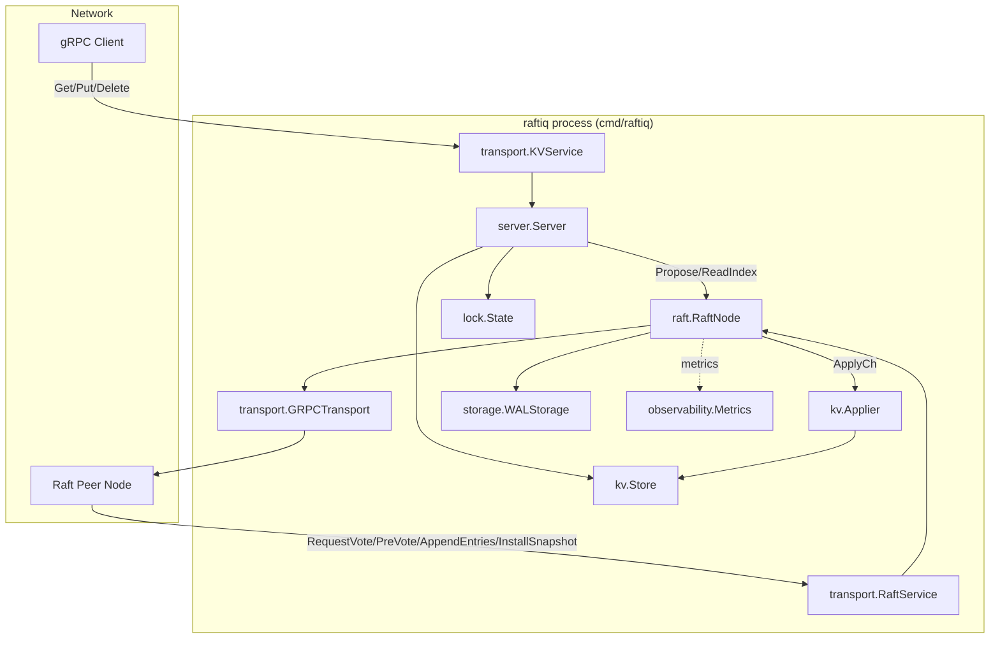
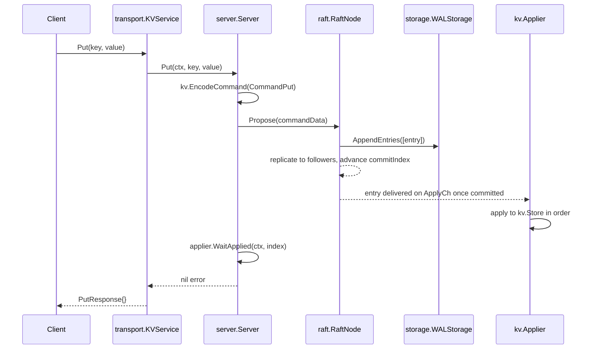
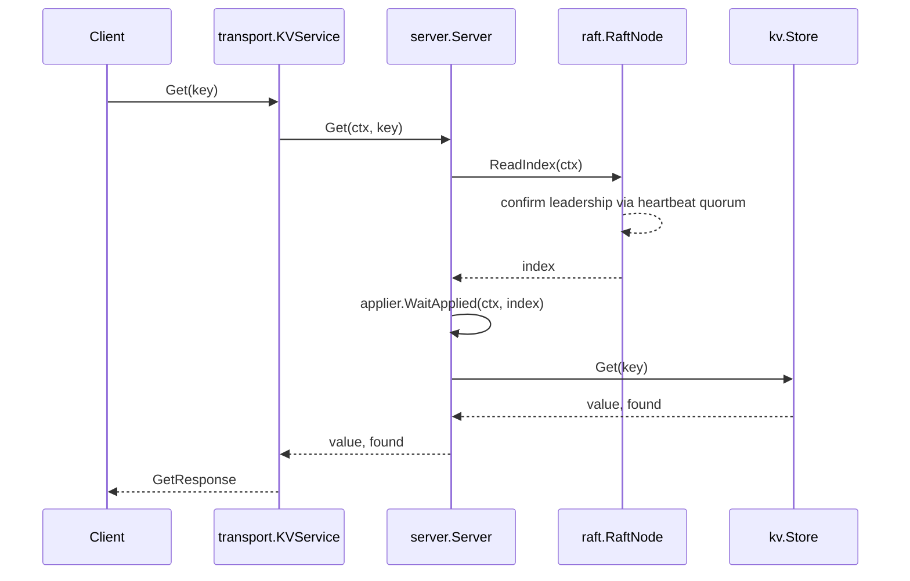

# Architecture

See [`AUDIT.md`](AUDIT.md) for the evidence behind every status claim in
this document.

## Executive summary

RaftIQ separates four concerns into independent, interface-bound
subsystems: consensus (`internal/raft`), durable storage
(`internal/storage`), the deterministic state machine
(`internal/kv`, `internal/lock`), and network transport
(`internal/transport`). `internal/server` composes these into the process
that `cmd/raftiq` actually runs.

> Consensus decides *what* state transition is committed. The state
> machine decides *how* that committed transition changes application
> state. `internal/raft` has no knowledge of what a log entry's bytes mean.

## Component diagram

## Process and package boundaries

A single `raftiq` process (`cmd/raftiq/main.go`) runs:

1. One `raft.RaftNode`, backed by one `storage.WALStorage` on `-data-dir`.
2. One `server.Server`, which owns the `kv.Store`, the `kv.Applier`
   (consuming `RaftNode.ApplyCh()`), and the `lock.State` used by
   `AcquireLock`/`FencedPut`.
3. Two gRPC listeners: `-raft-addr` (peer-to-peer `RaftService`) and
   `-kv-addr` (client-facing `KVService`).
4. One HTTP listener on `-metrics-addr` serving `/metrics`.

`internal/raft` is intentionally the only package with zero I/O
dependencies — it depends on `internal/model` and the `Storage`/`Transport`
interfaces it defines itself, nothing else. Every other package either
implements one of those interfaces (`storage.WALStorage`,
`transport.GRPCTransport`) or sits above `raft.RaftNode` and reacts to
`ApplyCh` / calls `Propose`/`ReadIndex` (`kv.Applier`, `server.Server`).

`internal/scheduler` and `internal/worker` are peers of `internal/kv` in
this model — libraries meant to sit above a replicated log — but
`cmd/raftiq` does not currently instantiate them. See
[`components/scheduler.md`](components/scheduler.md).

## Data flow: a write (Put)

If the node is not the leader, `RaftNode.Propose` returns an error and the
RPC fails — there is no leader-redirect payload in the response (see
[`AUDIT.md`](AUDIT.md)).

## Data flow: a linearizable read (Get)

See [`raft/linearizable-reads.md`](raft/linearizable-reads.md) for why
`ReadIndex` + `WaitApplied` together are required for linearizability.

## Failure handling, at a glance

- **Leader failure:** followers' election timers fire, PreVote + election
  run, a new leader is chosen from the majority with the most up-to-date
  log. See [`raft/leader-election.md`](raft/leader-election.md) and
  [`raft/failure-recovery.md`](raft/failure-recovery.md).
- **Follower failure:** the leader keeps committing as long as a majority
  of voters is reachable; a recovering follower catches up via
  `AppendEntries` backfill or `InstallSnapshot` if it's too far behind.
- **Network partition:** minority-side nodes cannot reach election majority
  or commit majority, so they cannot make progress; see
  `tests/chaos/network_partition_test.go`.
- **Crash / restart:** `storage.WALStorage.OpenWAL` replays valid records
  and truncates an incomplete trailing record. See
  [`persistence.md`](persistence.md) and [`storage/wal.md`](storage/wal.md).

## Observability

`internal/observability` provides Prometheus metrics
(`raftiq_raft_*`, `raftiq_rpc_*`, `raftiq_storage_*`, `raftiq_kv_*`,
scheduler/lease metrics), served at `/metrics` by `main.go`. Health and
readiness HTTP handlers exist in `internal/observability/health.go` and
`raft_readiness.go` but are not registered by `main.go` — see
[`components/observability.md`](components/observability.md).
