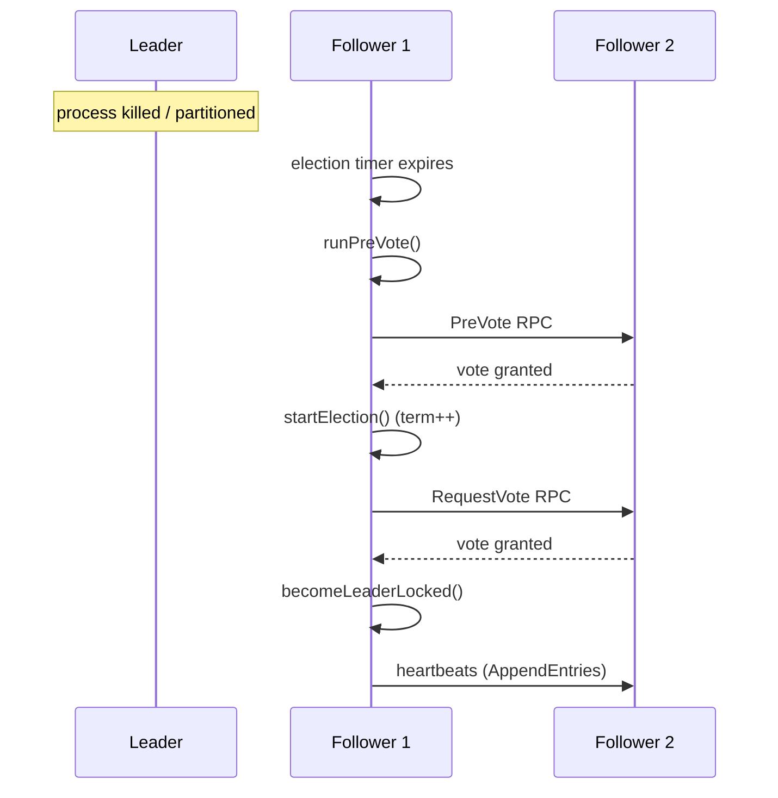

# Raft: Failure Recovery

This page ties together how RaftIQ behaves across the failure modes
`tests/chaos/` actually exercises. For the underlying mechanisms, see
[`leader-election.md`](leader-election.md),
[`log-replication.md`](log-replication.md), and
[`../persistence.md`](../persistence.md).

## Leader failure



Covered by `tests/chaos/leader_kill_test.go` (`TestLeaderKill`) — the
cluster must elect a new leader from the remaining majority and resume
accepting writes.

## Follower failure

The leader continues committing as long as a majority of the *current
effective configuration* is reachable (`membershipHasQuorum`) — a single
follower's absence doesn't block progress in a 3+ node cluster. When the
follower returns, it catches up via normal `AppendEntries` replication
(backfilling from its `nextIndex`) or via `InstallSnapshot` if the leader
has already compacted past what the follower needs. Covered by
`tests/chaos/follower_kill_test.go`
(`TestFollowerKill`/`TestFollowerRecovery`).

## Network partition

```text
Majority side (2 of 3 nodes): can elect a leader, can commit writes.
Minority side (1 of 3 nodes): cannot reach election majority,
                               cannot commit anything, effectively
                               unavailable for writes until the
                               partition heals.
```

`tests/chaos/network_partition_test.go` covers both a simple partition
(`TestNetworkPartition`) and an asymmetric one where messages flow in only
one direction between some node pairs (`TestAsymmetricNetworkPartition`).
Partitions are simulated via `LocalTransport.Block`/`BlockBidirectional`
rather than real network manipulation — see
[`../transport/local.md`](../transport/local.md).

If a former leader is on the minority side, it will keep believing it's
leader until its own term-check logic catches up (it can't get quorum on
`ReadIndex`/commit, so writes and linearizable reads through it will fail
even though it hasn't yet formally stepped down) — clients must be
prepared to retry against a different node rather than assuming the last
known leader is still authoritative. This is exactly why `ReadIndex`
requires live quorum confirmation rather than trusting local role state
alone.

## Crash and restart

A node process exiting (crash or graceful shutdown) and restarting with
the same `-id`/`-data-dir`:

1. `OpenWAL` replays the WAL, truncating any incomplete trailing record
   from a crash mid-write (see [`../storage/wal.md`](../storage/wal.md#recovery)).
2. `NewRaftNodeWithStorage` reconstructs `PersistentState` (term,
   voted-for, membership) and the log/snapshot boundary from what was
   recovered.
3. The node rejoins as a follower and catches up via normal replication.

No manual intervention is required for an ordinary crash/restart, as long
as the WAL file survived intact. Covered indirectly by the restart-related
membership tests (`TestRestartDuringJointConsensus`,
`TestRestartAfterLeaveJoint`,
`TestRestartedJointMembershipPreservesQuorumSafety`) and directly by the
WAL recovery tests in `internal/storage/wal_test.go`.

## Concurrent linearizability under failure

`tests/chaos/linearizability_test.go` (`TestLinearizability`) runs
concurrent client reads/writes while injecting leader/follower failures
and restarts, checking that the observed history remains linearizable
throughout — this is the strongest end-to-end correctness test in the
repository, since it doesn't just check individual mechanisms in
isolation but the composition of `Propose`, `ReadIndex`, `WaitApplied`,
and failure recovery together.

## What's *not* covered

- Disk-full (`ENOSPC`) during a live write is not exercised by a dedicated
  chaos test — see [`../AUDIT.md`](../AUDIT.md).
- Byzantine/malicious node behavior is out of scope entirely — see
  [`../transport/security.md`](../transport/security.md).
