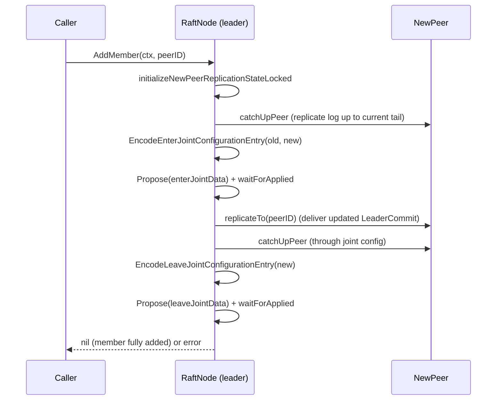

# Raft: Membership Changes

**Reachability note first:** everything on this page is implemented and
tested in `internal/raft`, but there is no gRPC RPC or CLI flag exposing
it. To change cluster membership today you must call
`RaftNode.AddMember`/`RaftNode.RemoveMember` directly from Go code
embedding the `raft` package. See [`../AUDIT.md`](../AUDIT.md) and
[`../operations.md`](../operations.md#addingremoving-a-node-from-a-running-cluster).

## Model

Membership is itself part of replicated, persisted state
(`model.PersistentState.Membership`, a `model.Membership` holding a
`Current` `model.Configuration` and an optional `Joint`
`model.JointConfiguration`). Changes are proposed as special log entries
(see `internal/raft/config_entry.go`), so they're replicated, ordered, and
crash-safe the same way KV commands are — there's no separate
out-of-band membership protocol.

## `AddMember(ctx, peerID)` — preconditions

All enforced with the caller's role/state held under `n.mu`:

1. Caller must currently be `Leader`.
2. `peerID` must not be the local node itself.
3. No membership change may already be in progress
   (`membership.Joint != nil` → rejected).
4. `peerID` must not already be a voter.
5. `peerID` must already be a **registered Raft peer**
   (`n.peerIDs`) — i.e. the transport needs to know how to reach it before
   it can be added as a voter. (`RegisterPeer` registers a peer without
   making it a voter.)

## `AddMember` — sequence

See [`joint-consensus.md`](joint-consensus.md) for why this is two phases
rather than one atomic switch.

## `RemoveMember(ctx, peerID)` — preconditions

1. Caller must currently be `Leader`.
2. **A leader cannot remove itself.** Rejected with
   `"cannot remove self %s: transfer leadership first"` — there is no
   automated leadership-transfer-then-remove flow; an operator would need
   to trigger a leadership change out of band (e.g. stop the current
   leader process, let a new one be elected, then call `RemoveMember`
   against the new leader) before removing the original leader's ID.
   Test: `TestRemoveMemberRejectsLeaderSelfRemoval`.
3. No membership change may already be in progress.
4. `peerID` must currently be a voter.
5. **The last remaining voter cannot be removed** —
   `len(oldConfiguration.Voters) <= 1` is rejected, since that would leave
   the cluster with no possible quorum.

`RemoveMember` goes through the same EnterJoint → LeaveJoint sequence as
`AddMember`, just with a shrunk voter set as the target configuration.

## Failure and restart safety

Both operations are extensively tested against mid-transition failures:

- `TestAddMemberFailsSafelyWhenNewPeerBecomesUnreachable` — the new peer
  going unreachable during catch-up doesn't corrupt cluster state.
- `TestRemoveMemberFailsSafelyDuringJointConsensus` — a failure while
  joint is in effect doesn't leave the cluster stuck.
- `TestLeaderFailureDuringJointConsensus` — the leader driving the change
  itself fails mid-transition; a new leader must be able to complete or
  safely recover the joint configuration.
- `TestRestartDuringJointConsensus`, `TestRestartAfterLeaveJoint`,
  `TestRestartedJointMembershipPreservesQuorumSafety` — a node restarting
  from its WAL while membership is (or was) joint must reconstruct the
  correct configuration and never compute quorum incorrectly.
- `TestRemovedLeaderCannotStartElection`,
  `TestRemovedLeaderCannotPreVote` — a node that's been removed from the
  voter set can't disrupt the cluster by trying to become leader again.

## Related

- [`joint-consensus.md`](joint-consensus.md) — the two-phase protocol itself
- [`../operations.md`](../operations.md) — operational reality of resizing a cluster today
