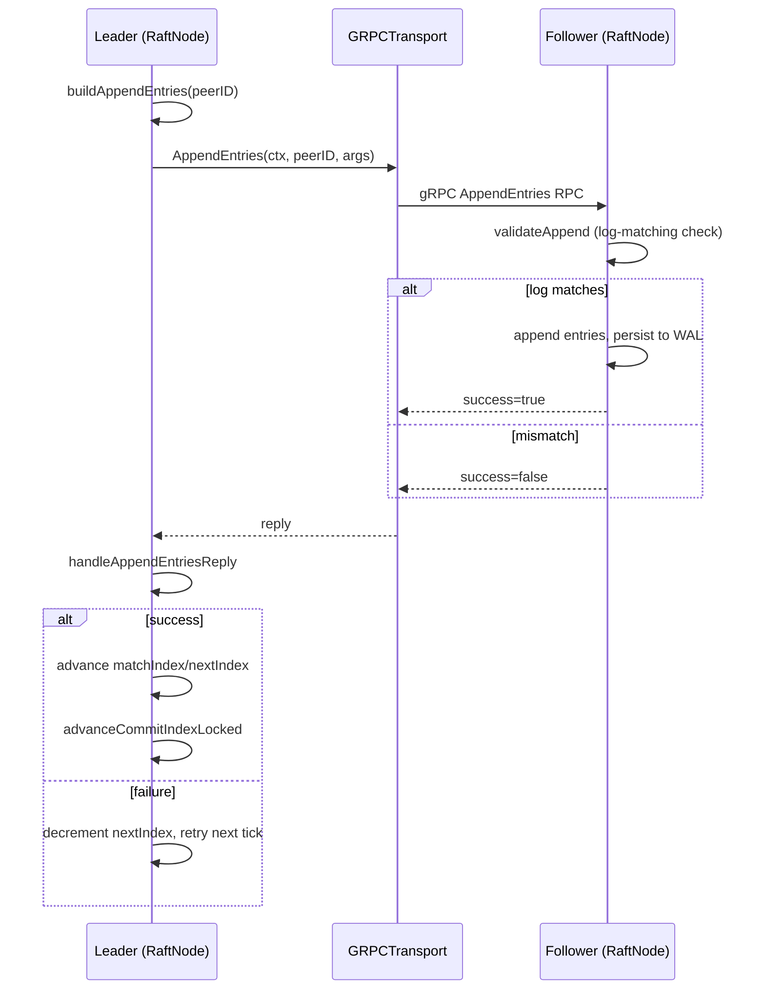

# System Design

This document covers the high-level design (HLD) and low-level design
(LLD) of RaftIQ. See [`architecture.md`](architecture.md) for the
component-level picture and [`AUDIT.md`](AUDIT.md) for what's actually
wired up versus library-only.

## HLD — High-Level Design

### Goals

- Implement Raft consensus (election, replication, commitment, snapshots,
  membership changes) correctly and safely, verified by tests rather than
  assumed from the paper.
- Provide a strongly consistent, replicated KV store on top of it.
- Provide fencing-token-based primitives (lock, scheduler/worker) suitable
  for coordinating external actors safely, as libraries.
- Make consensus internals genuinely unit-testable, without requiring a
  real network or real disk for most tests.

### System boundaries

RaftIQ is a single Go binary (`cmd/raftiq`) per node. Nodes communicate
over gRPC. Clients communicate over gRPC. There is no external
coordination service (no ZooKeeper/etcd dependency) — RaftIQ *is* the
consensus layer.

### Major components

See [`architecture.md`](architecture.md#component-diagram). In LLD terms,
the important seams are the `Transport` and `Storage` interfaces defined
in `internal/raft/transport.go` and `internal/storage/storage.go` — every
implementation detail below one of these interfaces can change without
touching `internal/raft`.

### Communication model

- **Peer-to-peer (Raft RPCs):** synchronous request/response gRPC calls —
  `RequestVote`, `PreVote`, `AppendEntries`, `InstallSnapshot` — defined in
  `api/proto/raftiq.proto`'s `RaftService`. Each call carries a `Term`; the
  callee steps down to follower if it sees a higher term (`becomeFollower`).
- **Client-to-node:** synchronous gRPC — `Get`, `Put`, `Delete` — via
  `KVService`. No leader-redirect metadata (see AUDIT.md); a client that
  gets an error should retry against another known peer.

### Persistence model

Every node persists its own `PersistentState` (current term, voted-for,
membership) and log entries to a local WAL (`storage.WALStorage`) before
they're considered durable. See [`persistence.md`](persistence.md).

### Consistency model

- **Writes:** linearizable by construction — a write is only acknowledged
  after being committed (replicated to a majority) and applied.
- **Reads:** linearizable *if and only if* served through `Get`, which
  uses `ReadIndex` + `WaitApplied`. Reading `kv.Store` directly (bypassing
  `server.Server.Get`) would return possibly-stale, non-linearizable data.

### Availability model

A cluster of `2f+1` voters tolerates `f` simultaneous voter failures
without losing write availability, standard Raft majority quorum. During a
joint configuration (mid membership-change), both the old and new voter
sets must each independently have a majority available — see
[`raft/joint-consensus.md`](raft/joint-consensus.md).

### Failure model

RaftIQ assumes fail-stop/omission node failures and message loss/delay/
reordering/duplication, not Byzantine (malicious) failures — no node
signs or authenticates its Raft RPCs beyond whatever TLS client-cert
verification an operator configures themselves (which the stock binary
does not do; see `docs/transport/security.md`).

### Scalability considerations

Raft's write throughput is bounded by the leader's ability to replicate to
a majority and by fsync latency on the WAL (`WALStorage.Sync`). RaftIQ
does not currently implement batching/pipelining of proposals beyond what
`AppendEntries` naturally batches per replication round — see
`buildAppendEntries` in `internal/raft/node.go`.

## LLD — Low-Level Design

### Major structs

| Struct | File | Role |
|---|---|---|
| `RaftNode` | `internal/raft/node.go` | Consensus state machine and driver loop |
| `Log` | `internal/raft/log.go` | In-memory log entry buffer with compaction |
| `WALStorage` | `internal/storage/wal.go` | Durable persistence for state/log/snapshots |
| `MemoryStorage` | `internal/storage/memory.go` | In-memory `Storage` for tests/non-durable runs |
| `Server` | `internal/server/server.go` | Glues raft + kv + lock for the binary |
| `Store` | `internal/kv/store.go` | KV state (the deterministic state machine data) |
| `Applier` | `internal/kv/applier.go` | Consumes `ApplyCh`, applies commands in order |
| `State` (lock) | `internal/lock/types.go` | Fencing-token lock table |
| `GRPCTransport` | `internal/transport/grpc_raft_transport.go` | Client side of Raft RPCs over gRPC |
| `LocalTransport` | `internal/raft/local_transport.go` | In-process transport for tests, supports partition simulation |
| `Scheduler` | `internal/scheduler/scheduler.go` | Job scheduling loop (library, not started by `main.go`) |
| `Worker` | `internal/worker/worker.go` | Job execution loop (library, not started by `main.go`) |

### Key interfaces

```go
// internal/raft/transport.go (conceptual — see file for exact signatures)
type Transport interface {
    RequestVote(ctx, target, args) (RequestVoteReply, error)
    PreVote(ctx, target, args) (PreVoteReply, error)
    AppendEntries(ctx, target, args) (AppendEntriesReply, error)
    InstallSnapshot(ctx, target, args) (InstallSnapshotReply, error)
}

// internal/storage/storage.go
type Storage interface {
    SaveState(state model.PersistentState) error
    LoadState() (model.PersistentState, error)
    AppendEntries(entries []model.LogEntry) error
    ReplaceSuffix(from model.LogIndex, entries []model.LogEntry) error
    LoadEntries() ([]model.LogEntry, error)
    SaveSnapshot(snapshot model.Snapshot) error
    LoadSnapshot() (model.Snapshot, error)
    Sync() error
    Close() error
}
```

`RaftNode` depends on both interfaces only — it's why `internal/raft` has
no `net`/gRPC/disk imports, and why `LocalTransport` + `MemoryStorage` can
stand in for real infrastructure in ~150 tests.

### Goroutine responsibilities

- `RaftNode.run()` / `runTick()` — the node's single driver goroutine:
  ticks the election/heartbeat clock, starts elections, sends heartbeats.
  Started by `RaftNode.Start()`.
- Per-RPC goroutines inside `replicateTo`/`requestVotes`/
  `sendInstallSnapshot` — one outbound RPC per peer per round, fired
  concurrently so a slow peer doesn't block replication to the others.
- `kv.Applier.Run(ctx, node.ApplyCh())` — one goroutine, started by
  `server.Server.Start()`, that reads committed entries off the channel and
  applies them to `kv.Store` strictly in order.
- `server.Server.runLockExpirationWorker()` — background goroutine that
  proposes lock-expiration commands once leases pass `ExpiresAt`.

### Locking / mutex ownership

`RaftNode` guards its state with `n.mu` (a `sync.RWMutex` per the `Locked`
suffix convention used throughout `node.go`, e.g. `becomeFollowerLocked`,
`advanceCommitIndexLocked`). Methods ending in `Locked` assume the caller
already holds `n.mu`; methods without the suffix acquire it themselves.
`Log` has its own internal mutex (`log.go`), separate from `RaftNode.mu`,
guarding the in-memory entry slice.

### Replication flow (LLD)



### Commit / apply flow (LLD)

`advanceCommitIndexLocked` finds the highest index replicated to a
majority *of the current (possibly joint) configuration* at the leader's
current term (the Raft "only commit entries from your own term directly"
rule), then `applyCommitted` pushes newly committed entries onto
`ApplyCh` in order for `kv.Applier` to consume.

### Snapshot flow (LLD)

`CreateSnapshot` validates the requested index is both committed and
already applied, asks the registered restore/snapshot hook
(`SetSnapshotRestore`) for the state machine's serialized state, then
calls `Log.Compact` and `Storage.SaveSnapshot`. A follower too far behind
the leader's compacted log receives `InstallSnapshot` instead of a log
backfill; see [`raft/snapshots.md`](raft/snapshots.md).

### Membership transition flow (LLD)

See [`raft/joint-consensus.md`](raft/joint-consensus.md) for the full
`AddMember`/`RemoveMember` sequence (catch-up → EnterJoint → wait applied →
re-replicate → catch-up-through-joint → LeaveJoint → wait applied).
